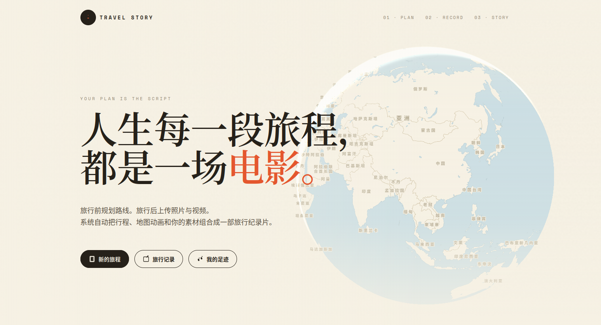
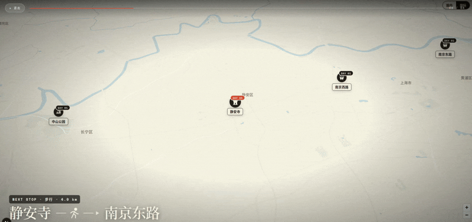
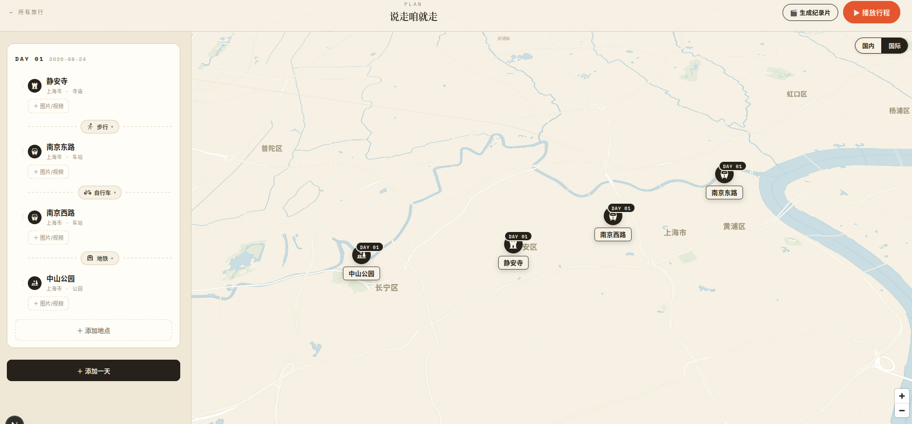
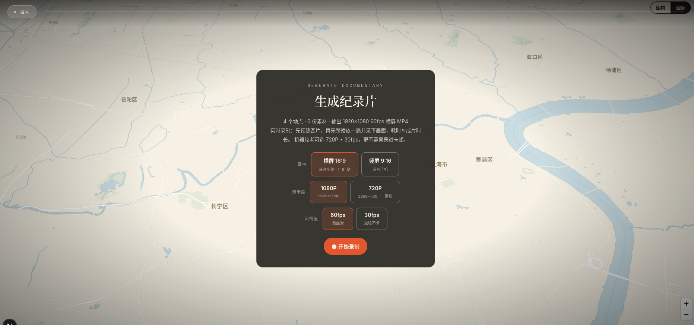

# Travel Story

> 把你的旅行，变成一部带地图动画与字幕的纪录片。

Travel Story 是一个面向个人使用的旅行规划与旅行影片生成工具：出发前按天安排地点和交通方式，旅行结束后为地点补上照片和视频，再让地图镜头、路线、载具和字幕沿时间线自动合成一段旅行影片。

它以单用户自部署方式运行，适合跑在自己的电脑、家庭服务器或可信局域网里。

## 项目展示

<div align="center">
  
</div>

<div align="center">
  从一个想法，到一条路线，再到一部影片 —— 一次旅行，一颗星球。
</div>

<p align="center">
  
</p>

<table>
  <tr>
    <td align="center">
      
      <br /><sub>规划 · 按天排行程，选交通方式</sub>
    </td>
    <td align="center">
      
      <br /><sub>成片 · 输出画幅、分辨率与帧率</sub>
    </td>
  </tr>
</table>

## 项目情况

### 它是什么

一段旅行做成一部影片，通常要攒素材、剪辑、配字幕，成本不小。Travel Story 把这条链路压缩成三步：**Plan 规划 → Record 记录 → Story 成片**。路线、载具、字幕、素材都由行程数据驱动，改动地点或素材，影片随之更新，省掉大量手工剪辑。

### 核心流程

1. **Plan** — 创建旅行，按天加入地点，为相邻地点选择汽车、步行、自行车、火车、飞机、轮船等交通方式，地图上实时画出路线。
2. **Record** — 旅行回来后，为每个地点上传照片或视频，素材保存在部署机器上，浏览器即可预览。
3. **Story** — 选择横/竖屏与分辨率，地图镜头沿时间线播放，自动合成时长与字幕，实时录制或用 FFmpeg 导出 MP4。

### 功能一览

| 模块   | 已实现                                                                                                                                                                                                   |
| ------ | -------------------------------------------------------------------------------------------------------------------------------------------------------------------------------------------------------- |
| Plan   | 创建/编辑/删除旅行；按天维护 Day 与地点；高德与 LocationIQ 国内外地点搜索；多种交通方式；道路/步行/骑行/大圆路线；国内与国际底图切换；全球足迹                                                           |
| Record | 为地点上传照片与视频；素材存于 `data/media/`；浏览器预览；视频 Range 响应                                                                                                                                |
| Story  | 地图镜头 + 路线 + 载具按序播放；照片/视频/字幕合成画布；16:9 与 9:16；720p 与 1080p；30 与 60 FPS；MediaRecorder 实时录制；WebCodecs 或 JPEG 帧离线渲染；FFmpeg 合成 MP4；NVIDIA NVENC，失败回退 libx264 |

**部分实现**：足迹元数据字段不保证完整；地图预热能减少空白瓦片但不保证 100%；WebCodecs / FFmpeg / NVENC 效果随浏览器与显卡而异；上游地图与路线服务依赖外部网络与额度。

**尚未实现**：账号与登录、多用户隔离、公开分享、权限控制；数据库（当前用平面文件 JSON）与对象存储；多设备同步与协作编辑；AI 规划行程、AI 文案、EXIF 自动重建、照片内容识别；背景音乐库、多套主题模板、在线任务队列、服务端分布式渲染、手机原生应用。

### 技术栈

Next.js 15 · React 19 · TypeScript · MapLibre GL · Turf.js · FFmpeg，地图与地点数据来自高德、LocationIQ、OpenFreeMap 与 OSRM。

## 快速开始

```bash
npm install
cp .env.example .env.local      # 至少配置一个地点搜索密钥，否则搜索无结果
npm run dev                     # 打开 http://localhost:3000
```

生产模式：`npm run build && npm start`。类型检查：`npm run typecheck`。

| 环境变量                  | 用途                                         | 默认值 |
| ------------------------- | -------------------------------------------- | ------ |
| `GAODE_KEY`               | 国内地点搜索、逆地理编码、国内步行与骑行路线 | 未配置 |
| `LOCATIONIQ_KEY`          | 国外地点搜索与逆地理编码                     | 未配置 |
| `MAX_MEDIA_UPLOAD_MB`     | 单个地点素材上传上限                         | 250 MB |
| `MAX_RECORDING_UPLOAD_MB` | 单个完整录像上传上限                         | 512 MB |
| `MAX_FRAME_BATCH_MB`      | 单批 JPEG 帧上传上限                         | 64 MB  |
| `MAX_TRIPS_BODY_MB`       | 行程 JSON 写入上限                           | 10 MB  |

密钥只写进 `.env.local`，不要给服务端密钥加 `NEXT_PUBLIC_` 前缀。

## 部署与边界

- 需要 Node.js 20+、npm、可用的 `ffmpeg` 命令、支持 WebGL 的现代浏览器。不生成影片时没有 FFmpeg 也不影响规划与地图预览。
- 应用数据默认写在项目根目录的 `data/`（行程、媒体、录像），国际地图瓦片缓存在 `tile-cache/`。升级、迁移或清理前请备份 `data/` 和自己的 `.env.local`，这两处都被 Git 忽略。
- 所有业务 API 没有登录校验，只要能访问服务即可读写行程、上传或删除素材、提交录像和触发 FFmpeg。建议只监听本机地址或放入可信局域网；需要暴露公网时，应在反向代理或应用层补充身份验证、HTTPS、速率限制与独立备份。

## 开源许可

项目使用 [MIT License](./LICENSE)。

## 关注与交流

如果你对旅行影片、自部署或地图动画感兴趣，欢迎关注公众号或加入交流群。

<table>
  <tr>
    <td align="center">
      
      <br />公众号
    </td>
    <td align="center">
      
      <br />交流群
    </td>
  </tr>
</table>

<!-- 群二维码更新提示：原图有效期到 2026-08-21 已过期，请通过公众号获取新入群方式，替换 public/readme/wechat-group.png 后即自动更新。 -->
